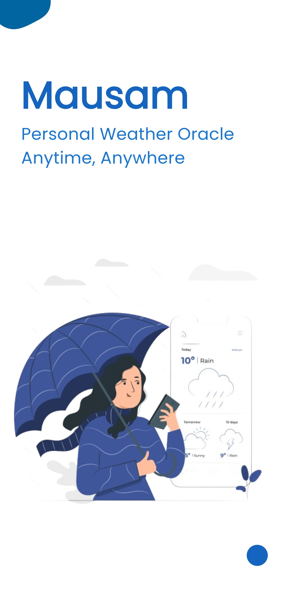
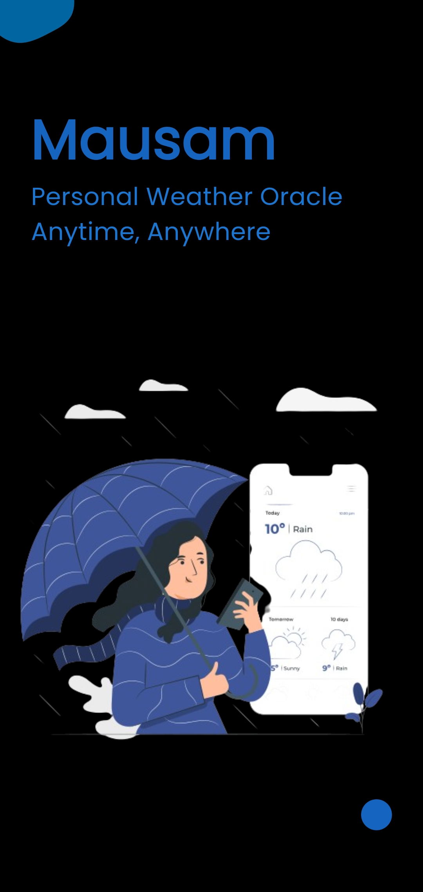
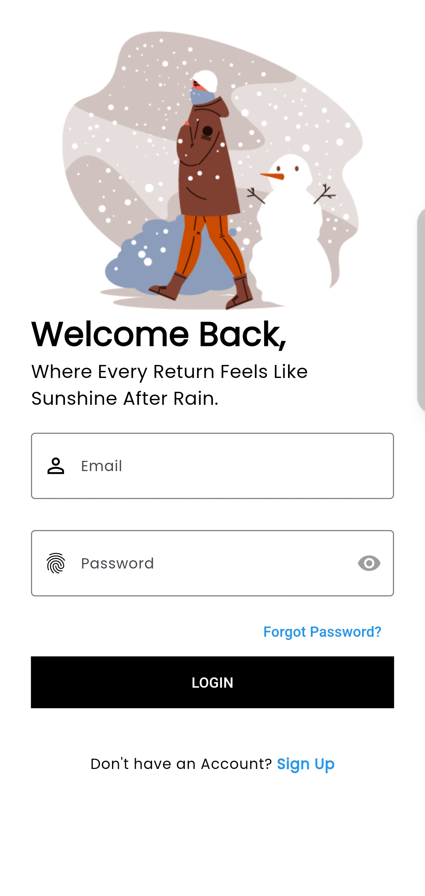
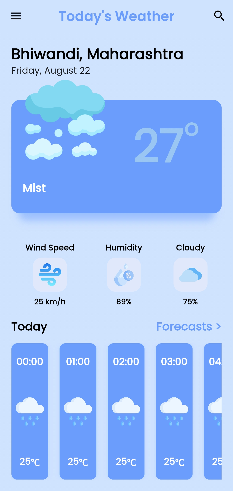
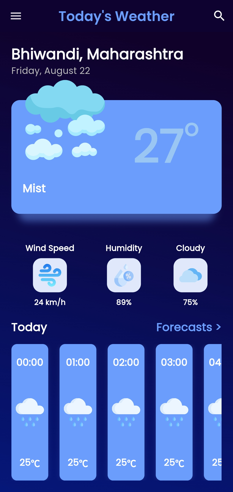
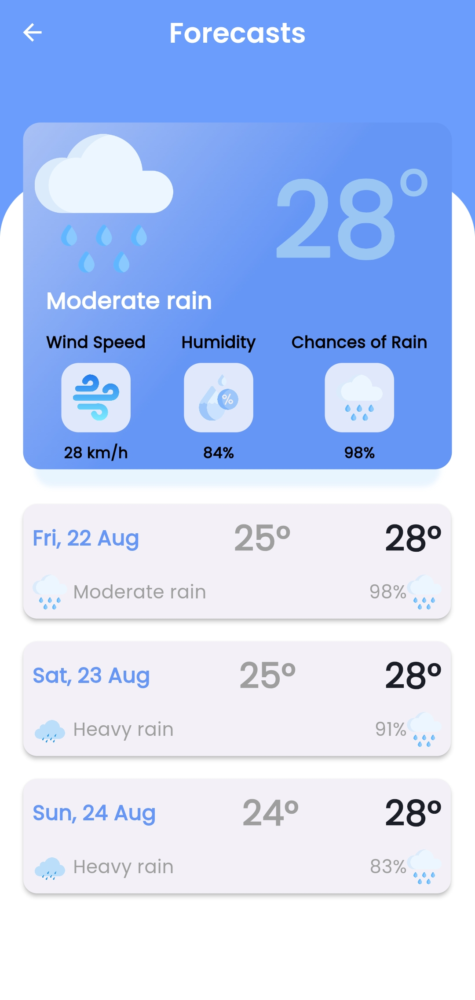
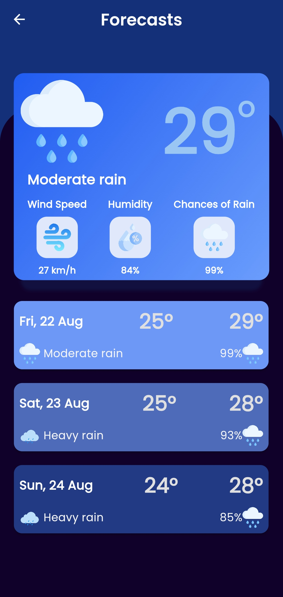
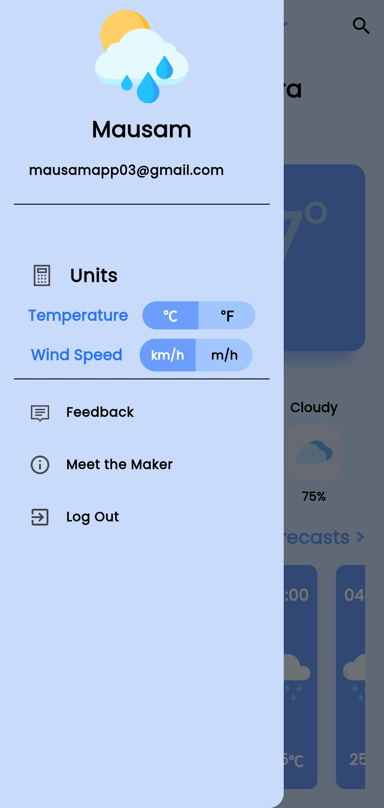
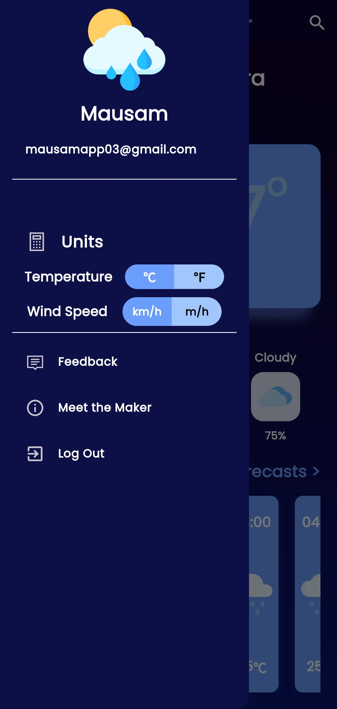

# 🌦️ Mausam – Personal Weather Oracle

A simple yet powerful **Flutter mobile app** that provides real-time, personalized weather updates in a clean and user-friendly way. This app showcases a deep understanding of mobile development, API integration, and user-centric design.

---

## 📸 Screenshots

The app features a clean, intuitive UI with full support for both light and dark modes, ensuring a great user experience anytime, anywhere.

| Screen | Light Mode | Dark Mode |
| :--- | :---: | :---: |
| **Splash Screen** |  |  |
| **Welcome Screen** |  |  |
| **Signup Page** |  |  |
| **Login Page** |  |  |
| **Home Page** |  |  |
| **Detail Forecast Page** |  |  |
| **Navigation Menu** |  |  |

---

## ✨ Key Features

- **Secure User Authentication:** Users can sign up, log in, and securely access personalized weather data. User credentials are safely stored and managed using Firebase Authentication.
- **Real-Time Weather Data:** Get current weather conditions, including temperature, humidity, wind speed, and cloud cover, powered by a reliable weather API.
- **Location-Based Forecasting:** The app automatically detects the user's location or allows for manual city selection to provide precise, hyperlocal forecasts.
- **7-Day Forecast:** Plan your week ahead with a detailed and easy-to-read 7-day weather forecast.
- **Dynamic Theming:** Full support for both **Light & Dark Mode** to enhance user comfort and accessibility.
- **Unit Customization:** Users can switch between preferred units for:
    - Temperature → °C / °F.
    - Wind speed → km/h / mph.
- **Responsive Design:** The UI is built to be responsive and accessible across a variety of Android devices and screen sizes.
- **In-App Feedback:** Users can share suggestions, issues, or reviews directly from the application's navigation menu.

---
##📲 Download the App
Get the app directly on your Android device by downloading the latest APK.
[Download APK](https://drive.google.com/file/d/1DA6LWB7K7Qw9sq2waF9msBeruY_jcWgg/view?usp=drivesdk)

---

## 🛠️ Tech Stack & Tools

The app was built using a modern and robust technology stack to ensure a high-quality user experience and maintainable codebase.

- **Frontend Framework:** Flutter.
- **Programming Language:** Dart.
- **Database and Cloud Services:** Firebase (Authentication, Cloud Firestore).
- **API Integration:** WeatherAPI.com for real-time and forecast data.
- **IDE:** Android Studio.
- **UI Design:** Material Design.
- **Version Control:** Git.

---

## 🚀 Getting Started

Follow these instructions to get the project up and running on your local machine for development and testing purposes.

### Prerequisites

- **Hardware:**
    - A multi-core processor (Intel Core i5 or equivalent recommended).
    - At least 8GB of RAM.
    - A Solid State Drive (SSD) with at least 10 GB of available storage is recommended.
- **Software:**
    - Flutter SDK.
    - Android Studio.
    - Git.
### Installation

1.  **Clone the repository**
    ```bash
    git clone https://github.com/romal20/Mausam-App.git
    cd Mausam-App
    ```

2.  **Set Up Firebase**
    - Create a new project on the [Firebase Console](https://console.firebase.google.com/).
    - Add an Android app to your project and follow the setup instructions.
    - Download the `google-services.json` file and place it in the `android/app/` directory of the project.

3.  **Configure API Key**
    - Get your free API key from [WeatherAPI.com](https://www.weatherapi.com/).
    - Create a file named `.env` in the root of the project.
    - Add your API key to this file. This is crucial to prevent exposing your key in the source code.
      ```
      API_KEY="YOUR_WEATHERAPI_API_KEY_HERE"
      ```

4.  **Install Dependencies and Run**
    ```bash
    # Get all the required packages
    flutter pub get

    # Run the app
    flutter run
    ```

---

## 🧑‍💻 Developer

- **Romal Shah**
- **Contact: mausamapp03@gmail.com**

